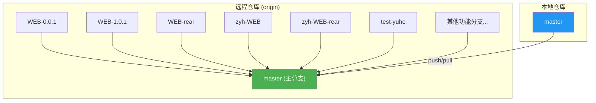
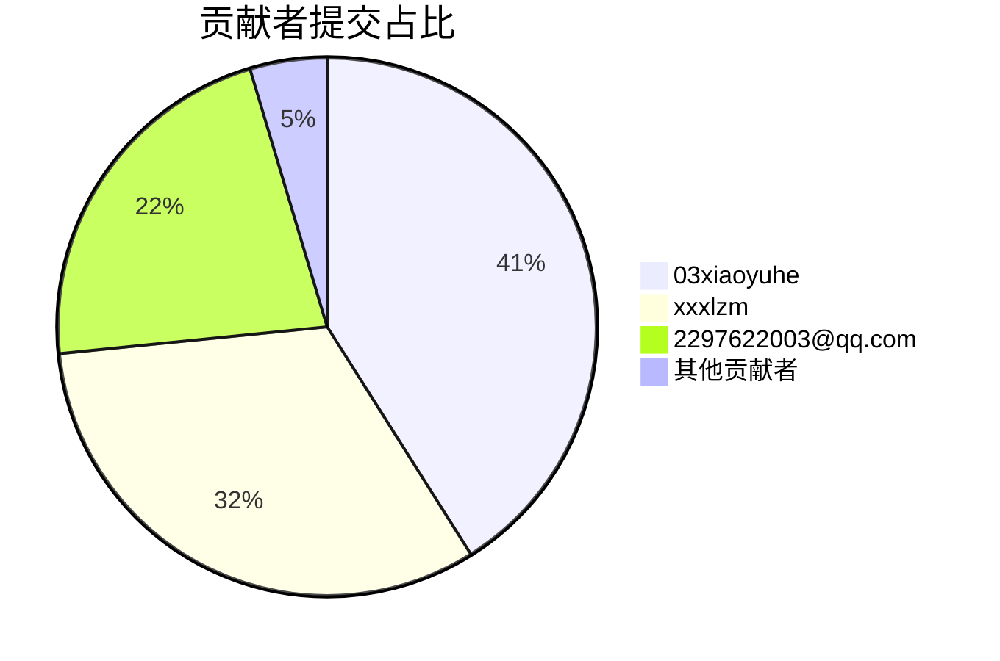
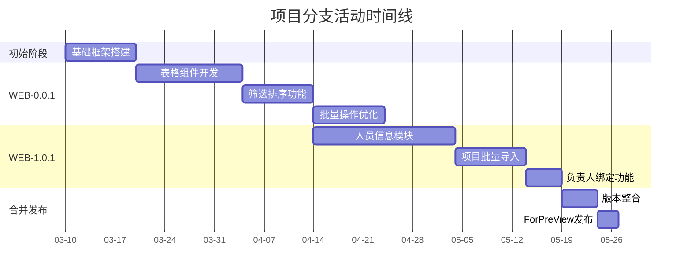

# Git 仓库分析报告

> 生成日期：2026-03-17

---

## 一、仓库概览

本报告基于 Git 仓库 `firstProgram` 的全面分析，该仓库托管于 GitHub 平台，由 03xiaoyuhe 团队维护。

### 1.1 基本信息

| 项目 | 内容 |
|------|------|
| 仓库名称 | firstProgram |
| 远程地址 | https://github.com/03xiaoyuhe/firstProgram.git |
| 本地分支 | master |
| 远程分支数量 | 21 个 |
| 标签 | ForPreView |
| 首次提交时间 | 2024-03-10 10:51:01 +0800 |

### 1.2 仓库状态

当前工作区状态为**干净**，无待提交的更改。master 分支与远程 origin/master 保持同步。

---

## 二、分支结构分析

### 2.1 本地与远程分支

仓库采用典型的开发流程分支结构，包含 1 个本地分支和 21 个远程分支。

**本地分支：**

- master（主分支，与远程同步）

**远程分支分布：**

| 分支类型 | 数量 | 说明 |
|----------|------|------|
| 功能分支 | 约 15 个 | 如 WEB-0.0.1、WEB-1.0.1、test-yuhe 等 |
| 个人开发分支 | 约 4 个 | 如 BLL-liukang、zyh-WEB、liuzimo-DAL 等 |
| 测试分支 | 2 个 | WEB-rear、zyh-WEB-rear |

### 2.2 分支命名规范分析

远程分支命名呈现出一定的规律性：

- **WEB 前缀**：表示 Web 相关功能分支（WEB-0.0.1、WEB-1.0.1、WEB-rear、zyh-WEB）
- **个人标识前缀**：如 zyh-、liuzimo-、guoruixue- 等，便于识别分支负责人
- **功能描述**：如 ForFileLoad、Rewrirte-MassagePop、precursor 等

**存在的问题：**
- 存在拼写错误，如 "Rewrirte-MassagePop"（应为 Rewrite）
- 分支命名风格不够统一，部分采用驼峰，部分采用连字符

---

## 三、贡献者分析

### 3.1 提交统计

| 贡献者 | 提交次数 | 占比 |
|--------|----------|------|
| 03xiaoyuhe | 71 | 41.5% |
| xxxlzm | 56 | 32.9% |
| 2297622003@qq.com | 38 | 22.2% |
| xiaoyuhe103@outlook.com | 5 | 2.9% |
| Administrator@XIAOYUHE103 | 2 | 1.2% |
| 118524259+qingkong555@users.noreply.github.com | 1 | 0.6% |
| **总计** | **171** | **100%** |

### 3.2 贡献者结构

项目主要由三名核心贡献者维护：

- **03xiaoyuhe** 是项目的主要维护者，贡献了超过 40% 的提交
- **xxxlzm** 是第二贡献者，贡献了约三分之一的提交
- **2297622003@qq.com** 也是重要的贡献者

这种贡献分布表明项目可能是一个小团队协作的开发项目，核心成员相对稳定。

---

## 四、可视化图表

### 4.1 分支结构图

### 4.2 贡献者分布

### 4.3 项目模块结构

```mermaid
flowchart LR
    subgraph Frontend["前端 (WEB)"]
        home["home.aspx"]
        query["QueryForm"]
        login["UserLoginon"]
        worker["WorkerLogin"]
    end
    
    subgraph Components["组件 (ASCX)"]
        timer["Timer"]
        table["Table"]
        test["Test"]
    end
    
    subgraph DAL["数据访问层"]
        db["DBHelper"]
        user["User*"]
        tableOp["TableSelect/Delete"]
    end
    
    subgraph EXE["可执行文件"]
        helper["EXEHelper"]
    end
    
    Frontend --> Components
    Components --> DAL
    DAL --> EXE
    
    style Frontend fill:#FF9800,color:#fff
    style DAL fill:#9C27B0,color:#fff
    style EXE fill:#607D8B,color:#fff
```

### 4.4 完整 Git 历史图（竖排）

```mermaid
gitGraph TB:
   commit id: "a87e52f Init"
   commit id: "3af6ce8 添加项目"
   commit id: "d4a2e7a DBHelper"
   commit id: "8935609 DBHelper更新"
   commit id: "d036d15 config"
   commit id: "146b987 前端"
   commit id: "7c8a6e0 Merge PR#3"
   commit id: "e169611 EXE类"
   branch zyh-WEB
   commit id: "c2361d5 DAL设计"
   commit id: "02fbff1 DAL开发"
   commit id: "2b85744 DB接口"
   checkout main
   merge zyh-WEB
   branch zyh-WEB-rear
   commit id: "437abef DBHelper升级"
   commit id: "6f7de1c 方案命名"
   checkout main
   merge zyh-WEB-rear
   branch WEB-0.0.1
   commit id: "33971f3 selectAll"
   commit id: "2915749 样式"
   checkout main
   commit id: "dba12f1 样式"
   checkout WEB-0.0.1
   commit id: "cd2ffba Merge"
   commit id: "f804489 1111"
   commit id: "1cb6626 111"
   checkout main
   commit id: "48ea369 添加"
   commit id: "3cb533e 样式美化"
   checkout WEB-0.0.1
   commit id: "955c871 Merge"
   commit id: "9747d4d 排序"
   checkout main
   commit id: "44987be 样式"
   commit id: "79ac031 Merge"
   checkout WEB-0.0.1
   commit id: "4efec7c Merge"
   commit id: "0ea841f 排序准备"
   checkout main
   commit id: "ad5d2c3 selectAll"
   commit id: "5f68aa8 排序样式"
   checkout WEB-0.0.1
   commit id: "64e9e76 Merge"
   commit id: "bd8ddec 3242"
   checkout main
   commit id: "ddf935c Web.config"
   commit id: "f82b00c Merge"
   checkout WEB-0.0.1
   commit id: "755aaca 111"
   commit id: "3ca5b52 筛选日期"
   commit id: "06013f5 Merge"
   commit id: "b9e3fe1 111"
   checkout main
   commit id: "05c4c85 样式"
   commit id: "c0458ae Bug修复"
   commit id: "66ab87a Merge"
   checkout WEB-0.0.1
   commit id: "90d0678 Merge"
   commit id: "667bc5b 筛选"
   checkout main
   commit id: "dfd1df9 筛选bug"
   commit id: "1b50fb7 Merge"
   commit id: "22286f5 样式"
   commit id: "f58a840 3456"
   commit id: "7887fec Merge"
   checkout main
   commit id: "83ce7a4 筛选排序"
   commit id: "4922d32 框架"
   commit id: "d4daf04 批量选择"
   commit id: "8f99d1c 信息处理"
   checkout main
   merge WEB-0.0.1
   commit id: "c2361d5 DAL"
   commit id: "2667a5b ProjectControl"
   commit id: "8982afe 方案名称"
   commit id: "c0e2947 项目访问类"
   commit id: "a51b4f7 文件夹"
   commit id: "34db05d 快速插入"
   commit id: "d72b707 详细信息"
   commit id: "2ad3dae 批量导入"
   commit id: "9b35f85 人员访问类"
   commit id: "f1bc703 项目访问类"
   commit id: "b180a3a 快速添加"
   commit id: "ee5eb2b 人员查询"
   commit id: "7c85f15 负责人绑定"
   commit id: "b1f540d README" tag: "ForPreView"
```

### 4.5 分支活动时间线

---

## 五、近期活动分析

### 5.1 最近五次提交

| 提交哈希 | 提交信息 | 日期 |
|----------|----------|------|
| b1f540d | Update README.md | 较近 |
| 8bf0b9f | Update README.md | 较近 |
| 454fc49 | Update README.md | 较近 |
| 6bdc5d7 | 修改了README文件 | 较近 |
| d80eeac | 再次调整 | 较近 |

### 5.2 活动特征

从最近五次提交来看，活动主要集中在文档维护层面：
- 所有提交都与 README.md 相关
- 提交信息较为简略，部分采用中文（如"修改了README文件"、"再次调整"）
- 提交频率较高，表明项目处于活跃维护状态

---

## 六、存在的问题与建议

### 6.1 分支管理建议

1. **统一分支命名规范**：建议制定明确的分支命名规范，如统一使用 kebab-case（连字符命名）风格，避免混用驼峰命名方式。

2. **定期清理过时分支**：当前存在 21 个远程分支，建议定期评估并合并或删除已完成或废弃的分支，以保持仓库整洁。

3. **建立分支策略**：建议明确各分支的用途，如 master 用于发布、develop 用于开发、功能分支用于特性开发等。

### 6.2 提交规范建议

1. **优化提交信息**：建议采用更规范的提交信息格式，如遵循 Conventional Commits 规范，明确说明修改类型（feat、fix、docs 等）。

2. **避免重复提交**：README.md 在短时间内多次提交，建议合并相关更改，使用有意义的提交信息说明修改目的。

### 6.3 协作建议

1. **代码审查机制**：建议对重要分支的合并实施代码审查流程，提高代码质量。

2. **贡献指南**：建议创建 CONTRIBUTING.md 文件，明确贡献流程和规范。

---

## 七、总结

firstProgram 是一个活跃的 Git 仓库，由约 6 位贡献者共同维护。项目采用典型的多分支开发模式，拥有 21 个远程分支用于不同功能和个人开发工作。

当前仓库状态良好，与远程保持同步。主要工作集中在文档维护和功能开发上。建议后续加强分支管理和提交规范，以提高团队协作效率。

---

*报告生成工具：OpenCode Git Analysis*
